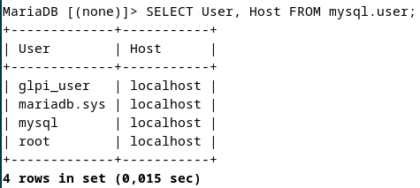

# Installation GLPI

Documentation : Installation de GLPI sur Debian 12

---

[Installation GLPI Agent](https://www.notion.so/Installation-GLPI-Agent-1a5e237e470080d2a490c15ac6b4e3af?pvs=21)

---

# Présentation :

GLPI (Gestionnaire Libre de Parc Informatique) est un outil open-source pour la gestion des ressources informatiques. Voici un guide complet pour installer GLPI sur un serveur Debian 12.

## Prérequis

1. **Système d'exploitation** : Debian 12.
2. **Accès root** ou utilisateur avec des privilèges sudo.
3. **Composants requis** :
    - Serveur web : Apache
    - Serveur de base de données : MariaDB
    - PHP (version >= 8.1)

## Étape 1 : Mise à jour du système

Mettez à jour les paquets existants :

```bash
sudo apt update && sudo apt upgrade -y

```

## Étape 2 : Installation des dépendances

Installez Apache, MariaDB, PHP et les extensions requises pour GLPI :

```bash
sudo apt install apache2 mariadb-server php php-{curl,gd,intl,apcu,xml,mbstring,zip,opcache,cli} unzip wget -y

```

Redémarrez Apache :

```bash
sudo systemctl restart apache2

```

## Étape 3 : Configuration de la base de données

1. Connectez-vous à MariaDB :

```bash
sudo mysql -u root -p

```

1. Créez une base de données et un utilisateur pour GLPI :

```sql
CREATE DATABASE glpi;
CREATE USER 'glpi_user'@'localhost' IDENTIFIED BY 'root';
GRANT ALL PRIVILEGES ON glpi.* TO 'glpi_user'@'localhost';
FLUSH PRIVILEGES;
EXIT;

```



## Étape 4 : Téléchargement et installation de GLPI

1. Rendez-vous dans le répertoire web :

```bash
cd /var/www/html

```

1. Téléchargez la version 10.0.18 de GLPI :

```bash
wget https://github.com/glpi-project/glpi/releases/download/10.0.18/glpi-10.0.18.tgz

```

1. Extrayez l'archive :

```bash
tar -xvzf glpi-10.0.18.tgz

```

1. Modifiez les permissions :

```bash
sudo chown -R www-data:www-data glpi
sudo chmod -R 755 glpi

```

## Étape 5 : Configuration d'Apache

1. Créez un fichier de configuration pour GLPI :

```bash
sudo nano /etc/apache2/sites-available/glpi.conf

```

Ajoutez le contenu suivant :

```
<VirtualHost *:80>
    ServerAdmin admin@example.com
    DocumentRoot /var/www/html/glpi
    ServerName 172.168.0.60

    <Directory /var/www/html/glpi>
        Options FollowSymLinks
        AllowOverride All
        Require all granted
    </Directory>

    ErrorLog ${APACHE_LOG_DIR}/glpi_error.log
    CustomLog ${APACHE_LOG_DIR}/glpi_access.log combined
</VirtualHost>
```

1. Activez le site et les modules requis :

```bash
sudo a2ensite glpi.conf
sudo a2enmod rewrite
sudo systemctl reload apache2

```

## Étape 6 : Installation via l'interface web

1. Accédez à GLPI dans un navigateur :

```
http://172.168.0.60

```

1. Suivez les instructions à l'écran pour terminer l'installation.
2. Utilisez les identifiants par défaut pour vous connecter :
    - **Utilisateur** : `glpi`
    - **Mot de passe** : `glpi`

## Étape 7 : Post installation

1. Changez les identifiants par défaut.
2. Supprimez le répertoire `install` pour des raisons de sécurité :

```bash
sudo rm -rf /var/www/html/glpi/install

```

---

GLPI est maintenant installé et fonctionnel sur votre serveur Debian 12. Vous pouvez commencer à l'utiliser pour gérer vos ressources informatiques !